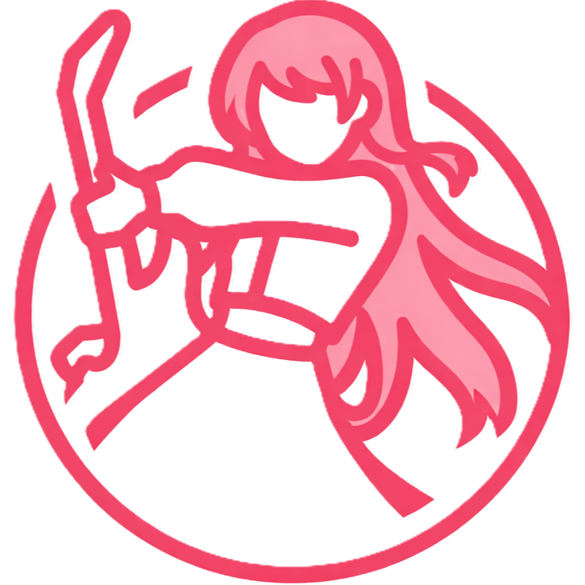
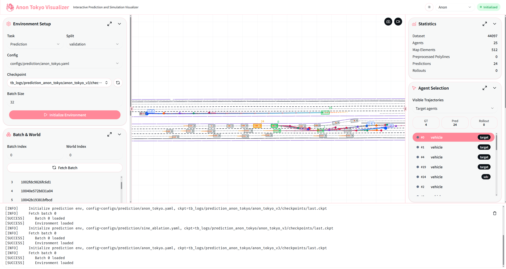
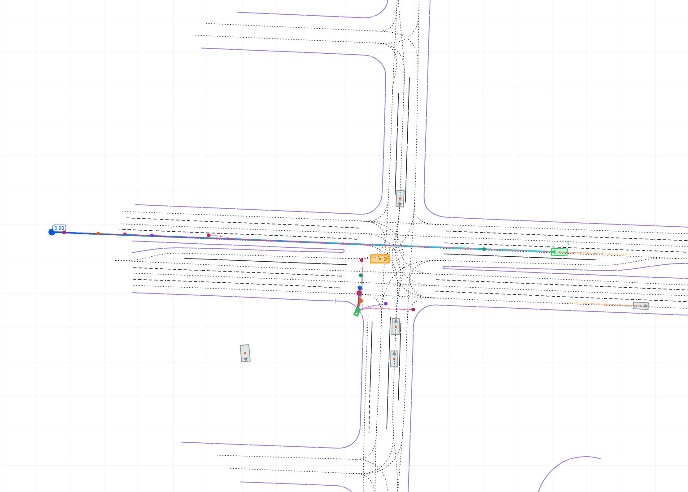
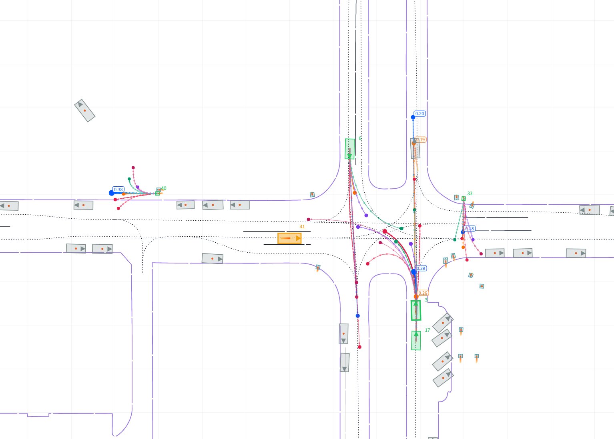
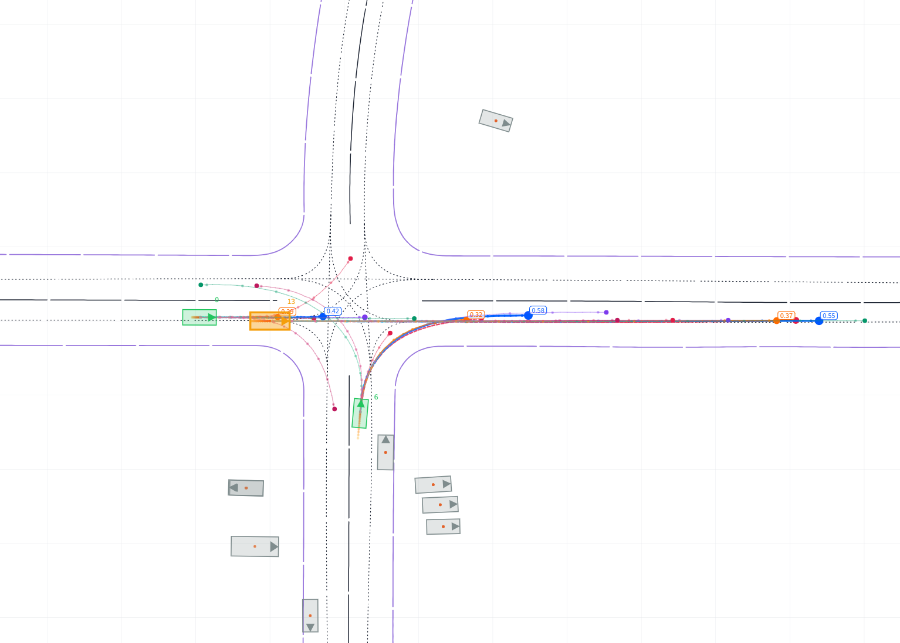

# AnonTokyo

<p align="center">
  
</p>

AnonTokyo is a research and engineering project for multi-agent interaction modeling in autonomous driving. It covers
open-loop trajectory prediction, closed-loop PPO simulation training, official Waymo Open Motion Dataset (WOMD)
evaluation, and web-based visualization. The central goal is to keep the efficiency of a Scene-Centric single forward
pass while using RoPE / DRoPE positional encodings and sparse top-k attention to model translation- and rotation-aware
spatial interactions.

## Highlights

- **Unified task framework**: one codebase for open-loop trajectory prediction and closed-loop simulation training.
- **Three interaction paradigms**: Agent-Centric, Query-Centric, and AnonTokyo Scene-Centric PPO configurations.
- **RoPE / DRoPE encoding**: translation- and direction-aware rotary positional encoding inside sparse attention.
- **MTR baseline reproduction**: MTR-style prediction model, CUDA attention / knn extension build script, and official
  WOMD evaluation export pipeline.
- **Complete data pipeline**: WOMD TFRecord preprocessing into per-scenario NPZ files and binary shards.
- **Interactive visualization**: FastAPI + Vue web app for inspecting scenes, agent trajectories, and closed-loop
  rollouts.

## Preview

<p>
  
</p>

### Prediction

<p>
  
  
  
</p>

### Simulation

<p>
  
  
  
</p>

## Project Layout

```text
.
├── configs/
│   ├── prediction/          # Open-loop prediction configs: MTR, AnonTokyo, RoPE/DRoPE ablations
│   └── simulation/          # Closed-loop PPO configs: Agent-Centric, Query-Centric, AnonTokyo
├── scripts/                 # Data preprocessing, training, evaluation, and CUDA ops build scripts
├── src/anon_tokyo/
│   ├── data/                # WOMD dataset, shard I/O, data transforms
│   ├── nn/                  # Shared network modules: RoPE, attention, polyline encoder
│   ├── prediction/          # Prediction models, loss, metrics, Lightning module
│   ├── simulation/          # Closed-loop env, dynamics, rewards, PPO, simulation models
│   └── visualize/           # Serialization and web visualizer backend/frontend
├── tests/                   # Unit and integration tests
├── third_party/mtr_ops_src/ # MTR CUDA attention / knn extension source
├── train_prediction.py      # LightningCLI prediction training entrypoint
├── train_sim.py             # PPO simulation training entrypoint
└── visualize.py             # Web visualizer entrypoint
```

## Requirements

- Python >= 3.12
- CUDA environment with a PyTorch wheel compatible with CUDA 12.8
- `uv` is recommended for the main training environment
- WOMD TFRecord preprocessing needs a separate Python 3.10 environment because TensorFlow / Waymo SDK dependencies
  conflict with the main PyTorch environment
- `pnpm` is required for the web frontend

Install the main environment:

```bash
uv sync --extra dev
```

Build the MTR CUDA extensions if needed:

```bash
bash scripts/build_mtr_ops.sh
```

The script builds from `third_party/mtr_ops_src` by default and copies the generated `.so` files into
`src/anon_tokyo/prediction/mtr/ops/`. Rebuild after changing Python, PyTorch, CUDA, or GPU architecture.

## Data Preparation

The project uses these default paths:

```text
data/raw/        # Raw WOMD TFRecords
data/processed/  # One .npz file per scenario
data/shards/     # Binary shards + index.json used for training
```

MTR / AnonTokyo intention query initialization requires the
[official MTR cluster center file](https://github.com/sshaoshuai/MTR/blob/master/data/waymo/cluster_64_center_dict.pkl).
Download it to `assets/mtr/cluster_64_center_dict.pkl`:

```bash
mkdir -p assets/mtr
wget -O assets/mtr/cluster_64_center_dict.pkl \
  https://github.com/sshaoshuai/MTR/raw/master/data/waymo/cluster_64_center_dict.pkl
```

Create the dedicated preprocessing environment:

```bash
uv venv .venv-scripts --python 3.10
.venv-scripts/bin/pip install tensorflow==2.12 waymo-open-dataset-tf-2-12-0 ray tqdm numpy
```

Run preprocessing, verification, and shard packing end to end:

```bash
bash scripts/run_preprocess.sh \
  --raw_dir data/raw \
  --out_dir data/processed \
  --shard_dir data/shards \
  --splits "training validation testing" \
  --num_cpus 32
```

Or run the steps manually:

```bash
.venv-scripts/bin/python scripts/preprocess_womd.py \
  --raw_dir data/raw \
  --out_dir data/processed \
  --splits training validation \
  --num_cpus 32

uv run python scripts/pack_shards.py \
  --src_dir data/processed \
  --dst_dir data/shards \
  --splits training validation \
  --scenes_per_shard 512 \
  --num_cpus 32
```

## Open-Loop Trajectory Prediction

Train the MTR baseline:

```bash
bash scripts/train.sh \
  --task prediction \
  --config configs/prediction/mtr_baseline.yaml
```

Train AnonTokyo:

```bash
bash scripts/train.sh \
  --task prediction \
  --config configs/prediction/anon_tokyo.yaml \
  --version anon_tokyo_v1
```

Call LightningCLI directly:

```bash
uv run python train_prediction.py fit \
  --config configs/prediction/anon_tokyo.yaml
```

Available prediction configs:

- `configs/prediction/mtr_baseline.yaml`
- `configs/prediction/anon_tokyo.yaml`
- `configs/prediction/rope_ablation.yaml`
- `configs/prediction/drope_ablation.yaml`
- `configs/prediction/sine_ablation.yaml`

## Official WOMD Evaluation

Prediction evaluation has two steps:

1. Load a checkpoint in the main environment and export predictions to NPZ.
2. Run the official Waymo motion metrics in `.venv-scripts`.

Run the full prediction pipeline:

```bash
bash scripts/eval.sh \
  configs/prediction/anon_tokyo.yaml \
  checkpoints/last.ckpt \
  validation \
  results/anon_tokyo_predictions.npz
```

Run each step manually:

```bash
uv run python scripts/export_predictions.py \
  --config configs/prediction/anon_tokyo.yaml \
  --ckpt checkpoints/last.ckpt \
  --split validation \
  --output results/anon_tokyo_predictions.npz

.venv-scripts/bin/python scripts/eval_womd.py \
  --predictions results/anon_tokyo_predictions.npz \
  --eval_second 8 \
  --num_modes 6
```

## Closed-Loop Simulation Evaluation

Simulation checkpoints are evaluated with deterministic closed-loop rollouts in the main PyTorch environment. The shared
`scripts/eval.sh` wrapper automatically switches to simulation evaluation when the config is under `configs/simulation/`:

```bash
bash scripts/eval.sh \
  configs/simulation/anon_tokyo_ppo.yaml \
  tb_logs/simulation_anon_tokyo/checkpoint_100.pt \
  validation \
  results/anon_tokyo_sim_eval.json
```

Run the simulation evaluator directly for smoke checks or runtime overrides:

```bash
uv run python scripts/eval_sim.py \
  --config configs/simulation/anon_tokyo_ppo.yaml \
  --ckpt tb_logs/simulation_anon_tokyo/checkpoint_100.pt \
  --split validation \
  --output results/anon_tokyo_sim_eval.json \
  --max_batches 10 \
  --batch_size 32 \
  --rollout_steps 40
```

The JSON output includes aggregate rollout metrics such as `collision_rate`, `offroad_rate`, `goal_reaching_rate`, and
`mean_reward`.

## Closed-Loop PPO Simulation

First run a smoke test to validate the data loader and environment:

```bash
uv run python train_sim.py \
  --config configs/simulation/anon_tokyo_ppo.yaml \
  --smoke_env
```

Train on a single machine or cluster:

```bash
bash scripts/train.sh \
  --task simulation \
  --config configs/simulation/anon_tokyo_ppo.yaml \
  --version sim_anon_tokyo_v1
```

For multi-GPU runs, `scripts/train.sh` automatically reads `CUDA_VISIBLE_DEVICES`, `NPROC_PER_NODE`, or Volcengine ML
Platform environment variables and launches training with `torchrun`.

Available simulation configs:

- `configs/simulation/agent_centric_ppo.yaml`
- `configs/simulation/query_centric_ppo.yaml`
- `configs/simulation/anon_tokyo_ppo.yaml`

Common runtime overrides:

```bash
uv run python train_sim.py \
  --config configs/simulation/anon_tokyo_ppo.yaml \
  --batch_size 128 \
  --rollout_steps 40 \
  --num_updates 10 \
  --profile
```

Training logs and checkpoints are written to `tb_logs/` by default:

```bash
uv run tensorboard --logdir tb_logs
```

## Web Visualization

Install frontend dependencies:

```bash
cd src/anon_tokyo/visualize/web/frontend
pnpm install
cd -
```

Start the visualizer:

```bash
uv run python visualize.py
```

Or use the installed console command:

```bash
uv run anon-tokyo-visualizer --host 127.0.0.1 --backend-port 8766 --frontend-port 5173
```

Default addresses:

- Frontend: `http://127.0.0.1:5173`
- Backend: `http://127.0.0.1:8766`

For external access:

```bash
uv run python visualize.py --public
```

## Tests and Code Quality

Run all tests:

```bash
uv run pytest
```

Run selected tests:

```bash
uv run pytest tests/test_attention.py
uv run pytest tests/test_simulation.py
```

Run linting:

```bash
uv run ruff check .
```

## Configuration Notes

Prediction configs are loaded by LightningCLI and mainly contain:

- `trainer`: epochs, precision, DDP strategy, logger, checkpoint callbacks
- `model.model`: model class and architecture parameters
- `model.optimizer_*` / `scheduler_kwargs`: optimizer and learning-rate schedule
- `data`: shard / NPZ paths, batch size, agent and polyline truncation limits

Simulation configs are loaded by `train_sim.py` and mainly contain:

- `model`: PPO policy class and model parameters
- `data`: WOMD split, controlled-agent selection, batch size
- `env`: rollout length, dynamics bounds, reward weights
- `ppo`: learning rate, rollout steps, GAE, clipping, entropy / value loss weights
- `trainer`: log directory, checkpoint interval, logging interval

## Research Background

Agent-Centric methods obtain strong spatial invariance by normalizing coordinates around each target agent, but each
target agent requires an independent forward pass. Query-Centric methods share scene encoding, but maintain pairwise
relative-position matrices whose memory cost grows quadratically with the number of scene elements. Plain Scene-Centric
methods are efficient, but lack explicit spatial invariance.

AnonTokyo uses shared Scene-Centric encoding and injects RoPE / DRoPE into attention heads to implicitly model relative
displacement and heading relationships. The goal is a practical trade-off among accuracy, memory footprint, and
throughput.

## Notes

- Download WOMD separately and place the raw files under `data/raw`; this repository does not include the dataset.
- `assets/mtr/cluster_64_center_dict.pkl` should be downloaded from the
  [official MTR repository](https://github.com/sshaoshuai/MTR/blob/master/data/waymo/cluster_64_center_dict.pkl). It is
  used to initialize MTR / AnonTokyo intention queries.
- Keep the preprocessing environment separate from the main training environment to avoid TensorFlow / Waymo SDK and
  PyTorch dependency conflicts.
- Generated MTR CUDA extension files are not tracked by Git. Re-run `scripts/build_mtr_ops.sh` after moving machines or
  changing the runtime environment.
- The large-batch PPO configs are intended for multi-GPU training. For single-GPU debugging, override `--batch_size`,
  `--rollout_steps`, and `--minibatch_size`.
